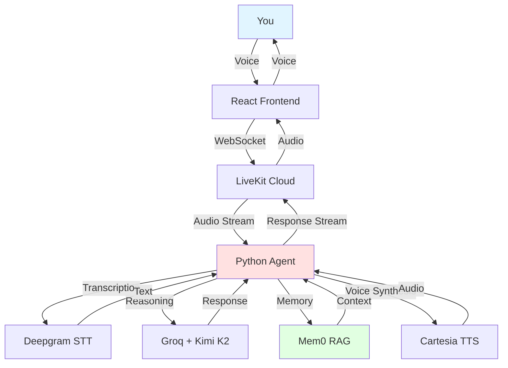

# Open Therapy

Making therapy accessible and affordable through AI voice technology.

## What is this?

Open Therapy is a voice-based AI therapist that costs pennies per session instead of hundreds of dollars. It uses a direct, New York-style therapeutic approach - supportive but real, calling out BS when needed while helping you grow.

The agent remembers past conversations, recognizes patterns over time, and has genuine continuity between sessions. It's not trying to replace human therapists, but it makes therapeutic support accessible when you need it.

## Why?

Therapy is prohibitively expensive for most people. A typical session costs $100-300. Open Therapy costs only what you pay for:
- **Speech recognition** (Deepgram: ~$0.01 per minute)
- **Voice synthesis** (Cartesia: ~$0.01 per minute)  
- **LLM inference** (Groq: ~$0.001 per minute)

**Total: ~$0.02 per minute or about $1 per hour-long session.**

## How it works



## Tech Stack

### Core Infrastructure
- **[LiveKit](https://livekit.io/)** - Real-time WebRTC communication  
  [Docs](https://docs.livekit.io/) | [GitHub](https://github.com/livekit/livekit)

### AI Services
- **[Groq](https://groq.com/)** with **Kimi K2 Instruct** - Ultra-fast LLM inference (~185 tokens/sec)  
  [Docs](https://console.groq.com/docs) | [Kimi K2 Model](https://groq.com/models/)
  
- **[Mem0](https://mem0.ai/)** - Semantic memory and RAG for conversation continuity  
  [Docs](https://docs.mem0.ai/) | [GitHub](https://github.com/mem0ai/mem0)

- **[Deepgram](https://deepgram.com/)** Nova-3 - Speech-to-text transcription  
  [Docs](https://developers.deepgram.com/) | [GitHub](https://github.com/deepgram)

- **[Cartesia](https://cartesia.ai/)** Sonic-3 - Text-to-speech + voice cloning  
  [Docs](https://docs.cartesia.ai/) | [GitHub](https://github.com/cartesia-ai)

### Frontend
- **[Next.js](https://nextjs.org/)** 15 + React 19 - Modern web framework
- **WebGL Gradient Engine** - Animated therapeutic background

## Getting Started

### Prerequisites

You'll need API keys for:
- LiveKit Cloud (free tier available)
- Groq (free tier: 30 req/min)
- Mem0 (free tier available)
- Deepgram (free $200 credit)
- Cartesia (free tier available)

### Setup

1. **Clone and install dependencies**
   ```bash
   git clone https://github.com/YOUR_USERNAME/open-therapy.git
   cd open-therapy
   
   # Python agent
   cd agent-python
   cp .env.local.example .env.local
   # Add your API keys to .env.local
   uv sync
   
   # React frontend
   cd ../agent-react
   cp .env.local.example .env.local
   # Add your API keys to .env.local
   pnpm install
   ```

2. **Configure API keys**
   
   Edit `.env.local` in both directories:
   ```bash
   LIVEKIT_API_KEY=your_key
   LIVEKIT_API_SECRET=your_secret
   LIVEKIT_URL=wss://your-project.livekit.cloud
   GROQ_API_KEY=your_key
   DEEPGRAM_API_KEY=your_key
   CARTESIA_API_KEY=your_key
   MEM0_API_KEY=your_key
   ```

3. **Run the agent (terminal 1)**
   ```bash
   cd agent-python
   uv run agent.py dev
   ```

4. **Run the frontend (terminal 2)**
   ```bash
   cd agent-react
   pnpm dev
   ```

5. **Open http://localhost:3001**

### Optional: Clone Your Voice

Click "Clone Your Voice" on the welcome screen and record 5-10 seconds of clear audio. The agent will use your voice for all responses, making the experience more personal.

## Features

- **Real-time voice conversation** - Natural back-and-forth dialogue
- **Persistent memory** - Remembers context across sessions
- **Pattern recognition** - Identifies recurring themes over time
- **Direct, compassionate approach** - Pushes back on problematic thinking
- **Voice cloning** - Personalize with your own voice (optional)
- **Therapeutic background** - Calming animated gradient

## Make It Your Own

The entire system is designed to be customizable:

**Therapeutic approach**: Edit `agent-python/system_prompt.txt` - change from direct New York style to something gentler, more clinical, or whatever works for you.

**Visual experience**: Modify `agent-react/public/gradient/gradient-engine.js` to adjust the background colors, speed, or patterns.

**Voice & models**: Edit `agent-python/agent.py` to swap in different LLMs, STT engines, or TTS voices. Want to use OpenAI instead of Groq? Different Deepgram model? Go for it.

## The Real Cost

A 45-minute session costs about **$1** to run:
- Speech recognition: $0.45
- Voice synthesis: $0.45  
- AI inference: $0.05

Traditional therapy? $150-300 for the same time.

That's not a typo. You can have **150-300 therapy sessions** for the price of one traditional appointment. No insurance battles, no waiting lists, no $50 copays.

## How It's Built

This runs as two processes: a Python agent handling the AI work and a React frontend for the UI. Everything uses hosted services (LiveKit, Groq, Deepgram, etc.) so you don't need GPUs or local models.

The agent responds in under a second thanks to Groq's LPU inference, and Mem0 handles semantic memory so it actually remembers what you talked about last week. LiveKit manages the WebRTC connection so the audio just works.

## Want to Help?

This project exists to make therapy accessible. Some ways to contribute:

- **Improve the therapeutic approach** - Better prompts, better responses
- **Reduce costs** - Find cheaper services or more efficient models
- **Add features** - Crisis detection, mood tracking, whatever helps
- **Share knowledge** - Write about what works, what doesn't

Open an issue or PR if you've got ideas.

## License & Disclaimer

MIT License - use this however you want if it helps people.

**Important**: This is an AI tool, not a licensed therapist. If you're in crisis or dealing with serious mental health issues, please reach out to a human professional:
- **988 Suicide & Crisis Lifeline**: Call or text 988 (US)
- **Crisis Text Line**: Text HOME to 741741 (US)
- Find a therapist: [Psychology Today Directory](https://www.psychologytoday.com/us/therapists)
