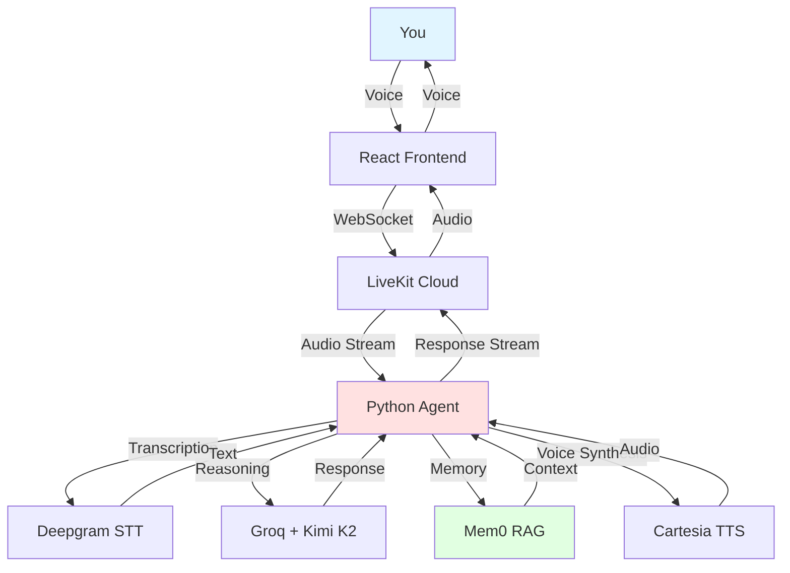

# Open Therapy

Making therapy accessible and affordable through AI voice technology.

## What is this?

Open Therapy is a voice-based AI therapist that costs pennies per session instead of hundreds of dollars. It uses a direct, New York-style therapeutic approach - supportive but real, calling out BS when needed while helping you grow.

The agent remembers past conversations, recognizes patterns over time, and has genuine continuity between sessions. It's not trying to replace human therapists, but it makes therapeutic support accessible when you need it.

## Why?

Therapy is prohibitively expensive for most people. A typical session costs $100-300. Open Therapy costs only what you pay for:
- **Speech recognition** (Deepgram: ~$0.01 per minute)
- **Voice synthesis** (Cartesia: ~$0.01 per minute)  
- **LLM inference** (Groq: ~$0.001 per minute)

**Total: ~$0.02 per minute or about $1 per hour-long session.**

## How it works



## Tech Stack

### Core Infrastructure
- **[LiveKit](https://livekit.io/)** - Real-time WebRTC communication  
  [Docs](https://docs.livekit.io/) | [GitHub](https://github.com/livekit/livekit)

### AI Services
- **[Groq](https://groq.com/)** with **Kimi K2 Instruct** - Ultra-fast LLM inference (~185 tokens/sec)  
  [Docs](https://console.groq.com/docs) | [Kimi K2 Model](https://groq.com/models/)
  
- **[Mem0](https://mem0.ai/)** - Semantic memory and RAG for conversation continuity  
  [Docs](https://docs.mem0.ai/) | [GitHub](https://github.com/mem0ai/mem0)

- **[Deepgram](https://deepgram.com/)** Nova-3 - Speech-to-text transcription  
  [Docs](https://developers.deepgram.com/) | [GitHub](https://github.com/deepgram)

- **[Cartesia](https://cartesia.ai/)** Sonic-3 - Text-to-speech + voice cloning  
  [Docs](https://docs.cartesia.ai/) | [GitHub](https://github.com/cartesia-ai)

### Frontend
- **[Next.js](https://nextjs.org/)** 15 + React 19 - Modern web framework
- **WebGL Gradient Engine** - Animated therapeutic background

## Getting Started

### Prerequisites

You'll need API keys for:
- LiveKit Cloud (free tier available)
- Groq (free tier: 30 req/min)
- Mem0 (free tier available)
- Deepgram (free $200 credit)
- Cartesia (free tier available)

### Setup

1. **Clone and install dependencies**
   ```bash
   git clone https://github.com/YOUR_USERNAME/open-therapy.git
   cd open-therapy
   
   # Python agent
   cd agent-python
   cp .env.local.example .env.local
   # Add your API keys to .env.local
   uv sync
   
   # React frontend
   cd ../agent-react
   cp .env.local.example .env.local
   # Add your API keys to .env.local
   pnpm install
   ```

2. **Configure API keys**
   
   Edit `.env.local` in both directories:
   ```bash
   LIVEKIT_API_KEY=your_key
   LIVEKIT_API_SECRET=your_secret
   LIVEKIT_URL=wss://your-project.livekit.cloud
   GROQ_API_KEY=your_key
   DEEPGRAM_API_KEY=your_key
   CARTESIA_API_KEY=your_key
   MEM0_API_KEY=your_key
   ```

3. **Run the agent (terminal 1)**
   ```bash
   cd agent-python
   uv run agent.py dev
   ```

4. **Run the frontend (terminal 2)**
   ```bash
   cd agent-react
   pnpm dev
   ```

5. **Open http://localhost:3001**

### Optional: Clone Your Voice

Click "Clone Your Voice" on the welcome screen and record 5-10 seconds of clear audio. The agent will use your voice for all responses, making the experience more personal.

## Features

- **Real-time voice conversation** - Natural back-and-forth dialogue
- **Persistent memory** - Remembers context across sessions
- **Pattern recognition** - Identifies recurring themes over time
- **Direct, compassionate approach** - Pushes back on problematic thinking
- **Voice cloning** - Personalize with your own voice (optional)
- **Therapeutic background** - Calming animated gradient

## Customization

### Change the therapeutic style

Edit `agent-python/system_prompt.txt` to adjust the agent's personality and approach.

### Modify the background

Edit `agent-react/public/gradient/gradient-engine.js` to change colors, speed, or animation patterns.

### Switch models

Edit `agent-python/agent.py` to use different:
- LLM models (Groq supports multiple providers)
- STT models (Deepgram has various options)
- TTS voices (Cartesia has 100+ voices)

## Cost Breakdown (Example)

For a typical 45-minute therapy session:
- Deepgram STT: 45 min × $0.01 = **$0.45**
- Cartesia TTS: 45 min × $0.01 = **$0.45**
- Groq LLM: 45 min × $0.001 = **$0.05**

**Total: ~$0.95 per session**

Compare to traditional therapy at $150-300 per session.

## Architecture Notes

- **Two processes**: Python agent (backend) + React frontend (UI)
- **Hosted services**: All AI services are cloud-based (no local models)
- **Real-time**: Sub-second latency with Groq's LPU inference
- **Memory**: Semantic search with Mem0 for context retrieval
- **WebRTC**: LiveKit handles all real-time communication

## Contributing

This project is about making therapy accessible. If you improve the system prompt, add features, or reduce costs, please share!

## License

MIT - Use it however helps people.

## Disclaimer

This is an AI assistant, not a replacement for licensed mental health professionals. If you're in crisis, please contact a human therapist or call a crisis helpline.
